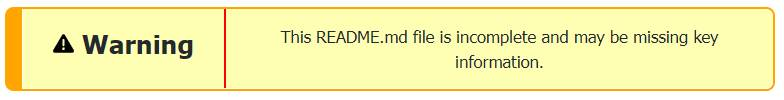

| Program Name     | **Course: Learn modern React by building 4 projects including a Firebase 9 app and a full stack MERN app** |
| ---------------- | ------------------------------------------------ |
| Public File Name | **README.md**                                    |
| Date Created     | 06/12/22                                         |
| Date Modified    | --                                               |
| Version          | 1.00                                             |
| Programmer       | Eric Hepperle                                    |
| Platform         | Udemy                                            |
| Leaarning Type   | Course                                           |

### TECHNOLOGIES:

// GITHUB
// MONGODB
// EXPRESS
// REACT
// NODE

 

## Purpose:
**<u>Course Work:</u>** Learn modern React by building 4 projects.

### Demonstrates

- React fundamentals including components, props, hooks, state, etc
- React hooks such as useState, useEffect, useContext, useReducer, useRef, etc
- Creating custom hooks
- React Router v6 (latest version)
- How to handle global state with context, reducers and hooks
- Firebase 9 authentication, queries, storage
- Deploying React apps to Vercel & Netlify
- Basic Animation with Framer Motion
- Implement Leaflet maps and Swiper sliders
- Fullstack MERN (MongoDB, Express, React, Node.js)
- REST API creation
- Redux
- Redux Toolkit
- Authentication with JWT

### Description

This course is for anyone that wants to learn React and also for React developers looking to build some projects and sharpen their skills.

The first project (Feedback App) is structured in a way so I can explain the fundamentals such as components, hooks, props, state, etc in a way that beginners can understand. The second project (Github Finder) will show you how to work with 3rd party APIs and the third project (House Marketplace) is a larger app that uses Firebase 9 and includes authentication, Firestore queries, file storage and more.

The final project has been added! It is a fullstack MERN support ticket system that uses Redux and Redux Toolkit.

### Included Projects

- Feedback app with in depth explanation of React fundamentals
- Build a house marketplace with React and Firebase 9
- Learn React hooks and how to create custom hooks
- Learn how to use context and reducers to manage global state
- Build a Fullstack MERN support ticket system with Redux Toolkit

## Course Info

- **Length:** 21.5 hours
- **Level:** Beginner & Intermediate
  
### Project Screenshots:

[PROJECT_SCREENSHOTS_PLACEHOLDER]

## Usage:
1. N/A
   
## Sample results: 

- N/A

## Requires:
* A web browser
* GitBash
* VS Code
  
## Based on this COURSE:
- Title: Modern JavaScript From The Beginning
- URL: https://udemy.com/course/modern-javascript-from-the-beginning
- Channel: Udemy

## TAGS:
`Modern JavaScript` `JavaScript` `ES6` `Project-Based Learning` `Course` `Udemy` `Traversy`

## VOCAB:
- Tutwrk: This is term I use to indicate the work I did when following a tutorial. This term is differentiated from tutorials I may create/author in the future that will be designated with the term "Tutorial".

## Resources:
- N/A
